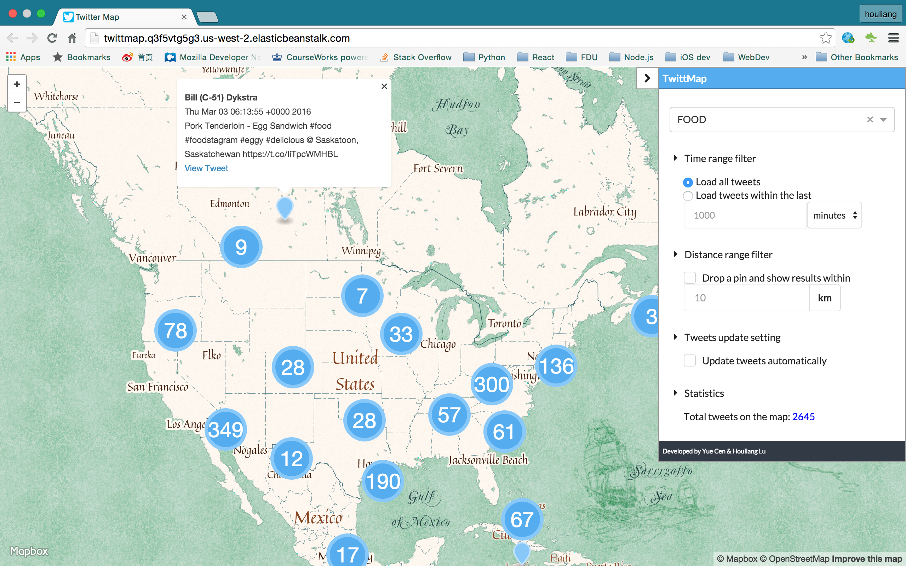

# TwitterMap



### AWS Demo
View the [twitter map](http://twittmap.q3f5vtg5g3.us-west-2.elasticbeanstalk.com/) on beanstalk. The app is deployed by Elastic Beanstalk, while the streaming and Elasticsearch parts are on another instance. Nginx is used to prevent public access to Elasticsearch.

### Twitter Map

- Get tweets from twitter Streaming API using pre-defined track words and store them to Elasticsearch engine.
- Use MapBox API to render these tweets on the map based on your configuration on control panel.
- You should choose a keyword from the dropdown list to display only those tweets which contain the keyword.
- You could filter the new tweets within last X minutes where X is your input.
- You could drop a pin and drag it on the map and configure the distance so that the app would shows tweets that are within this distance from this pin.
- You could choose to update tweets automatically.

### Stack
- Elasticsearch (tweet storage and search)
- Django (backend)
- React (frontend)

### Usage

##### Stream
```
// boot elasticsearch
$ ./elasticsearch

//cd to twittermap app root folder
$ python manage.py stream
```

##### Build JS
```
$ npm install
$ npm run build
```

##### Install Dependencies
```
// install dependencies with:
$ pip install -r requirements.txt
```

##### Start server
```
$ python manage.py runserver
```
